## [SSAFY 10기 광주 2반 6팀 좋을42 공통프로젝트]

## 🌐 갤역시(Galyuxy)(24/01/02 ~ 24/02/16)

## 📑 서비스 소개

갤역시 프로젝트는 <B>PWA를 활용하여 태블릿 어플</B>로 제공되는 초등학생을 위한 역사 활동 교육용어플입니다.
기존에 암기 위주였던 역사 교육을, <B>유물체험 , 드로잉, 화상채팅을 이용한 연극활동, AR 체험을 통해 흥미를 느끼고 더욱 기억에 오래 남는 학습으로 만들고자</B> 제작하였습니다.

 

## 🔧 기술 스택

- Backend : Spring, MySQL, Azure Maria DB,Spring Data JPA, Redis
- Frontend : React, Recoil, PWA
- Infra : AWS EC2, Nginx, SSL
- Database : MariaDB
- WebRTC : Openvidu 2.29.0

   

## 🖥️ 협업툴 및 협업환경

- Notion :
  기획 및 회의록 작성
  API문서, 기능 명세서 등 팀원 모두가 공유하는 산출물 기록
- JIRA :
  매주 목표량 설정하여 sprint 진행
  업무 할당량 정하여 Story Point 설정
- GitLab :
코드 버전 관리
이슈 발행 및 관리

   

## 🌐 주요기능

### 1. 3D 문화유산 체험

### 2. 컬러링북 미술활동

### 3. WEB RTC를 활용한 연극활동

### 4. 역사 퀴즈 활동

### 5. AR 체험

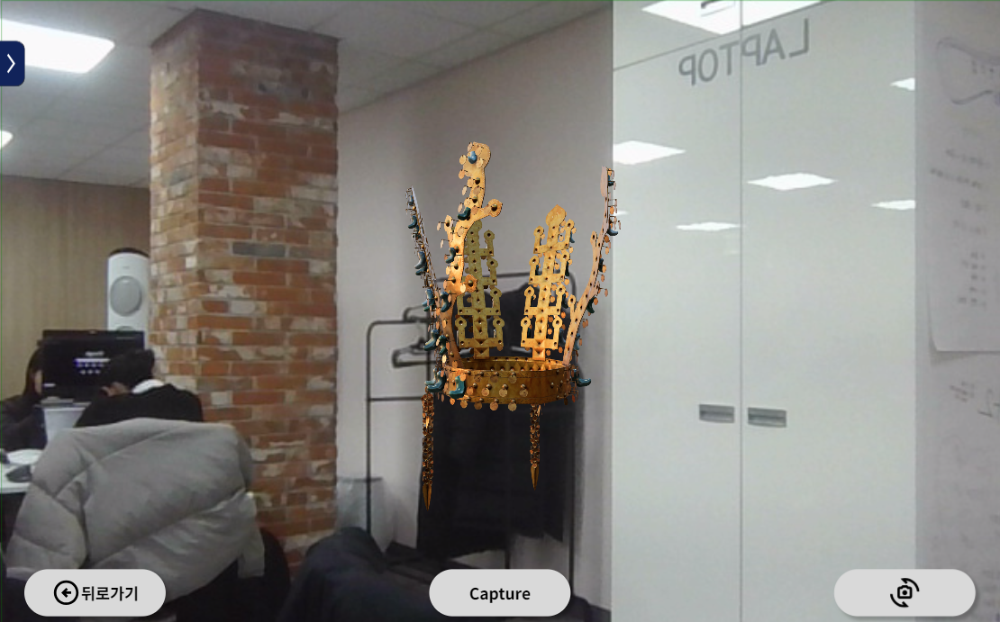

https://github.com/gisun55555/reactshop2/assets/139519062/53722006-eb09-4fcd-833f-640794f9c557
 

## 🌐 전체기능

### 교사

1. 로그인
   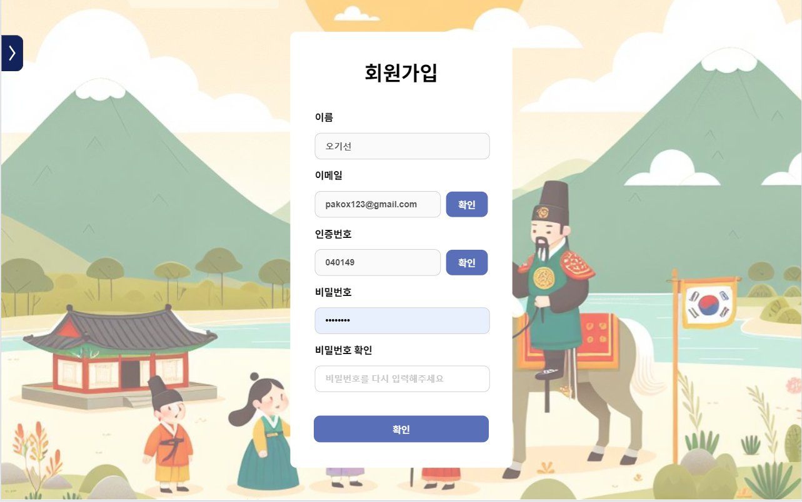
   이메일 인증을 이용한 회원가입
2. 클래스 생성/입장
   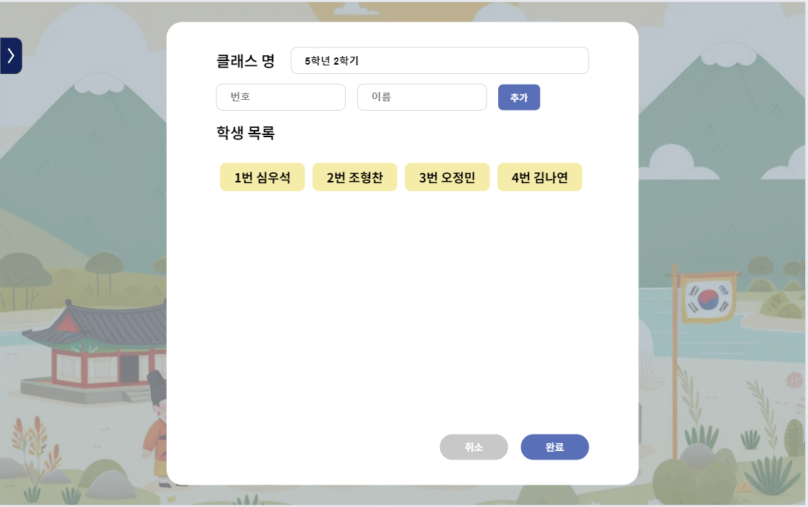
3. 역할극 방활동(수정)
   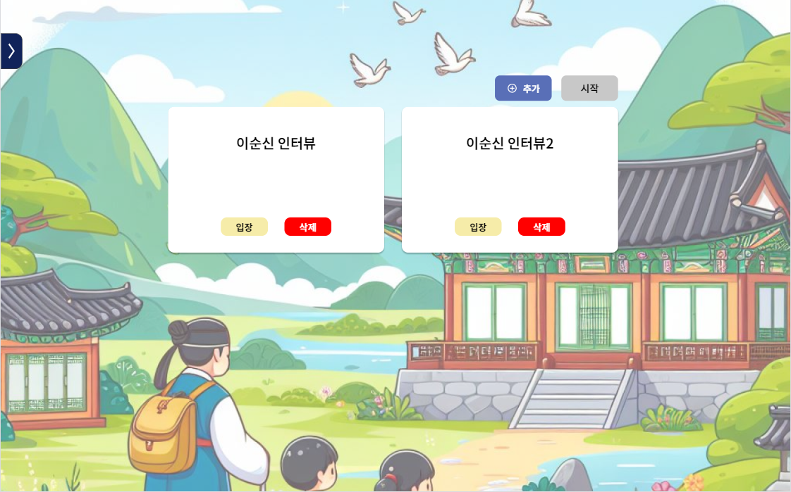
4. QR제공
   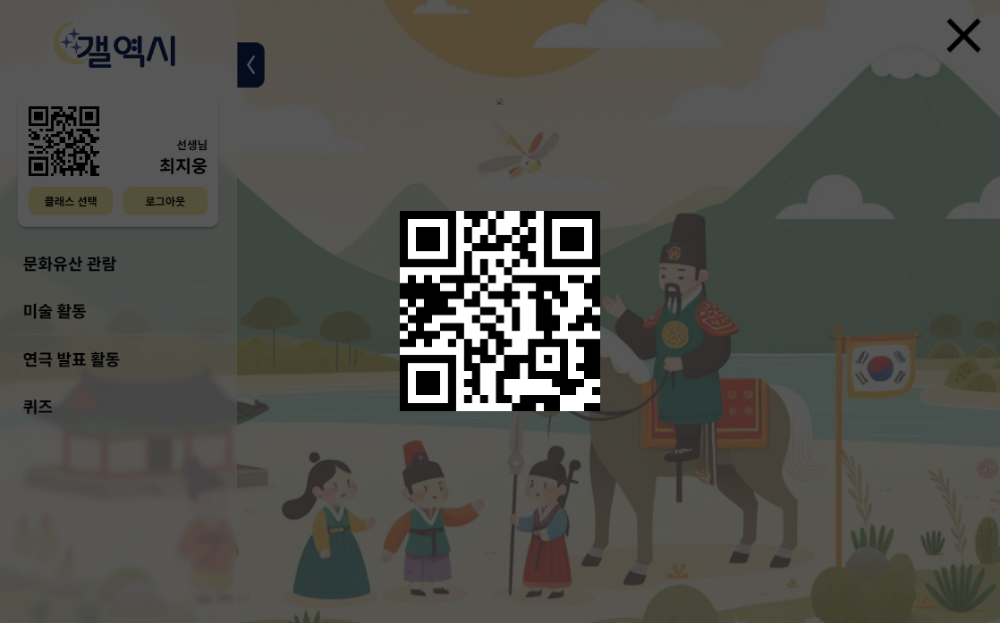

### 학생

1. QR로그인
   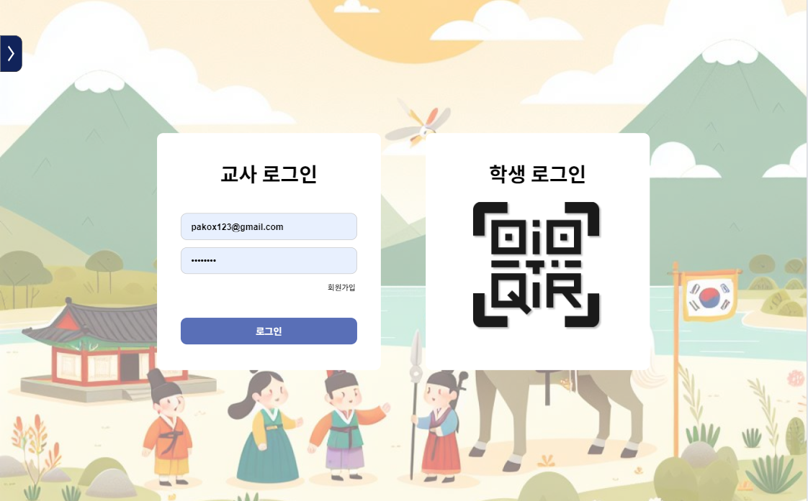

2. 로그인 후 화면
   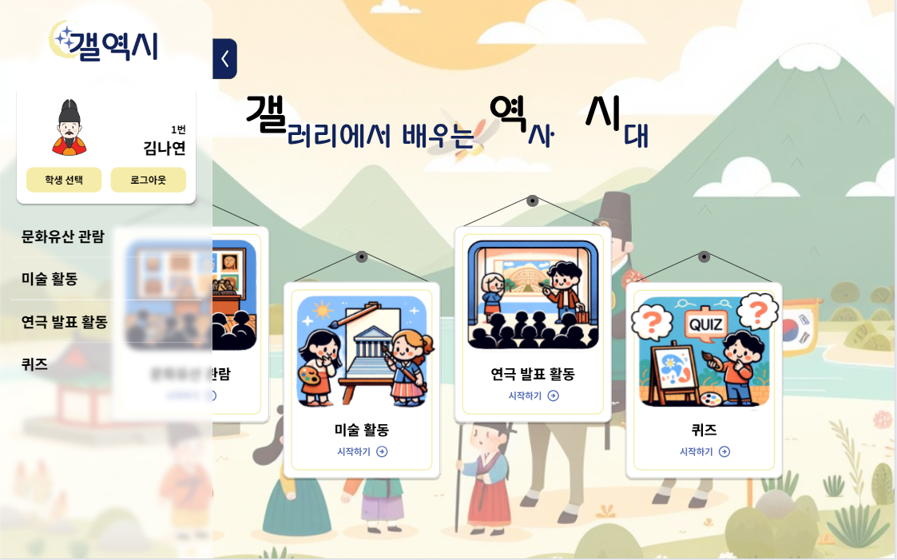
    

## 👨‍👩‍👧 팀원 소개 및 담당 역할

- **김나연(팀장)**
  - 백엔드 및 프론트엔드
  - 지라관리
- **김현영**
  - 백엔드 및 프론트엔드
  - 지라관리
  - 발표 제작 및 최종발표
- **최지웅**
  - 백엔드 및 프론엔드
  - CI/CD
  - 지라관리
- **오정민**
  - 프론트엔드
  - 지라관리
- **오기선**
  - 프론트엔드
  - 지라관리
- **조형찬**
  - 프론트엔드
  - UCC 제작
  - 중간 발표 제작 및 발표
     

## 📑 Planning & Design

### 시스템 아키텍쳐

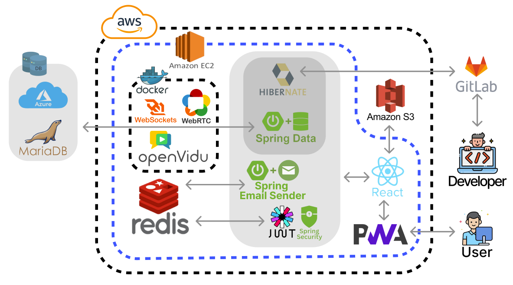

### Erd 다이어그램

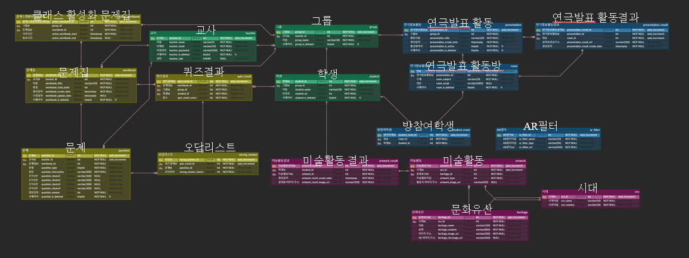

### Jira

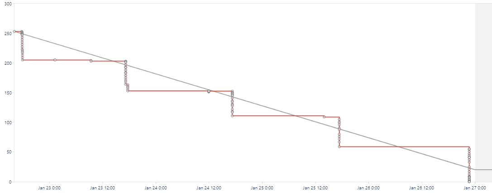

- 월요일에 회의 후 주 단위 스프린트 생성
- 개인당 일주일에 40시간 이상 이슈 생성 및 처리

### Api 명세서

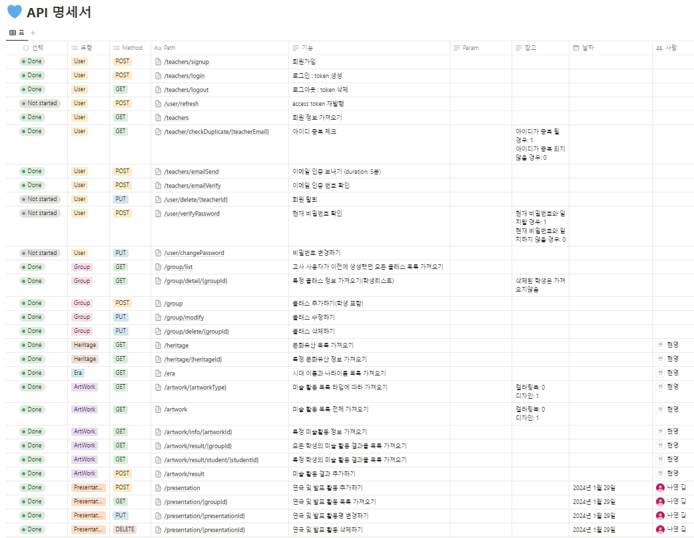

노션링크
https://judicious-rule-b00.notion.site/42-b8656a32fa804ef59ede97095087c57e?pvs=4
